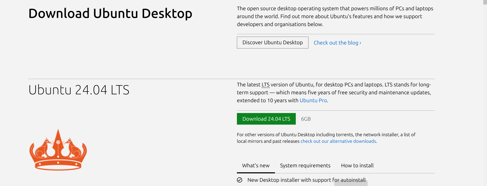
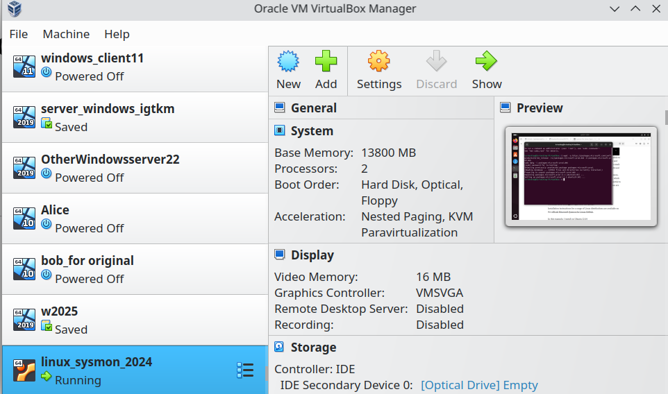
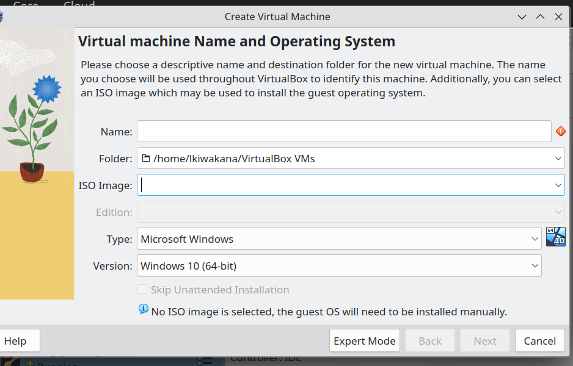
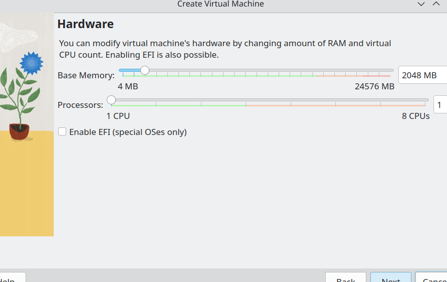
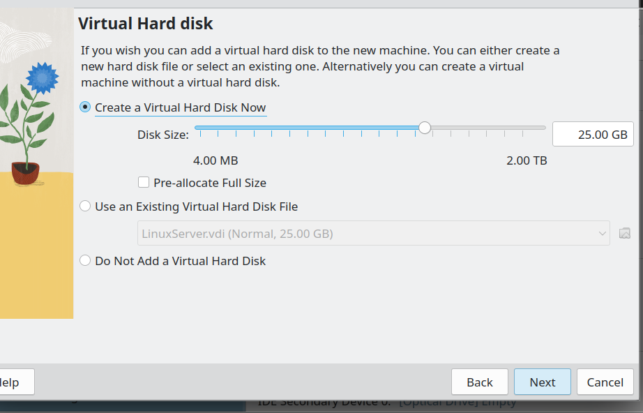
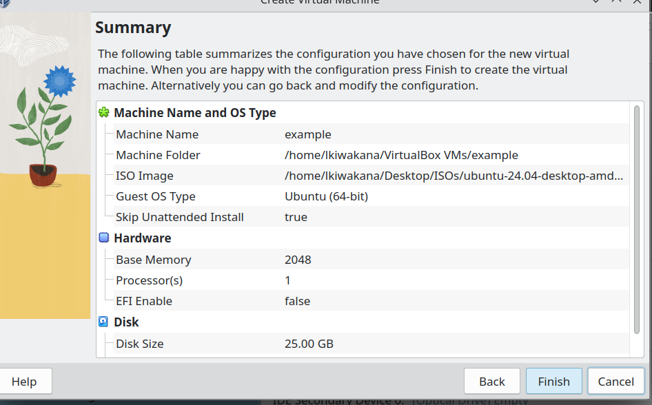

# Sysmon For Linux

## Setting Everything UP

### ISO
We first look for the ISO of our choice on our browser of choice, I use google:

After we click on the version of our choice and click download:

### VM

we open our virtual machine of choice, for me that is VirtualBox:

We name our project then choose the ISO we downloaded under the ISO section and select skip unatended installation, then click next:

We select the hardware capabilities needed (note that what I chose here is just general but select yours depending on what is needed to run the ISO of your choice)

And now we double check we have all the settings needed an click finish:

### Installing It on Our Machine

Personally I followed a guide given by the medium to install sysmon. You can find this guide [here](https://shreenkhalabhattarai.medium.com/sysmon-for-linux-c4acb93a53e3)

## To Do:
- Further test sysmon features in my linux environment 
